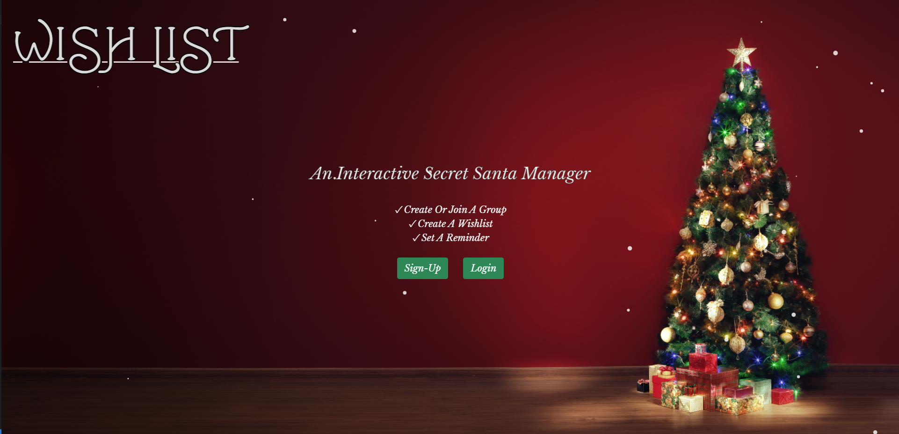

# WishList Manager

## Table of Contents

- [Description](#Description)
- [User Story](#User-Story)
- [Resources](#Resources)
- [Contributors](#Contributors)

## Deployed Site
https://wishlistmanager.herokuapp.com/



## Description
Wishlist is a website designed to take the hassle out of holiday party planning. It allows the user to create an account, create a wishlist, create a group, join a group, and see others wishlists. Wishlist allows the user to edit and update their personal wishlist in an easy and intuitive way. It also gives people the ability to be reminded of upcoming party details via email. Once members have all joined, the creator is able to randomly draw names of group members for gift exchange games, allowing each user to see the wishlist of the person they drew. 

## User-Story:
```
When a user open the website
Then they are presented with sign-up/login options
When one of those buttons is pressed
Then the user is taken to the corresponding page to sign-up or login
When the user signs-up or logs in
Then they are taken to their dashboard
When the user clicks the add to wishlist button
Then a modal appears to allow them to add, delete, and update their wishlist
When the user clicks the edit profile button
Then they can edit their information like email, username, and password
When the user clicks create a group
Then they are taken to the create a group page and prompted to enter group details
When the user clicks the create button on the create group page
Then they are taken to the group dashboard
When the user click join a group on the user dashboard
Then they are taken to the join a group page and prompted to enter group credentials
When the user clicks the join button on the join group page
Then they are taken to the group dashboard
When the user clicks the draw names button in the group they created
Then the group members are assigned someone to buy a gift for
When the user clicks on a gift of a member they were assigned to
Then those gift details are displayed to the user in a modal
When the user edits group details in the group they created and clicks update
Then they are notified that their group details have been successfully updated
When the user clicks logout on any screen
Then they are logged out and taken to homepage

```

## Resources:
- CSS Framework
    - BootStrap

- Other Technology
    - NodeMailer
    - Node-cron
    - Express-flash
    - Bcrypt

## Contributors
- Phalen: Worked with models, bcrypt, RESTful routing, handlebars rendering. Developed front-end/back-end functionality for all user interactions (signup/login/logout and resetting email/password/username) and gift interactions (adding/deleting/updating a gift and getting a single gift). Created server and connection files as well as styled the edit profile page as well as provided input for styling throughout application.

- Sam: pirimary contributor to styling of application from color schemes, animation, backgrounds and layouts. Also built out html code that was used in handlebars for landing page, login/signup page, and profile page.

- Jeremiah: Developed front-end/back-end functionality for all group interactions (adding new group/new user to groups, password checking for groups, random assignment for gift exchange, and updating group deatils), worked on email reminder function, models, and provided styling input throughout application.

Phalen:
- [Phalen's Github](https://github.com/PhalenH)
- Email Phalen at: phalenhazel@gmail.com

Sam Kennedy: 
- [Sam's Github](https://github.com/kennedysam168)
- Email Sam at: kennedysam168@gmail.com

Jeremiah Quill: 
- [Jeremiah's Github](https://github.com/jeremiah-quill)
- Email Jeremiah at: jcq5010@gmail.com
